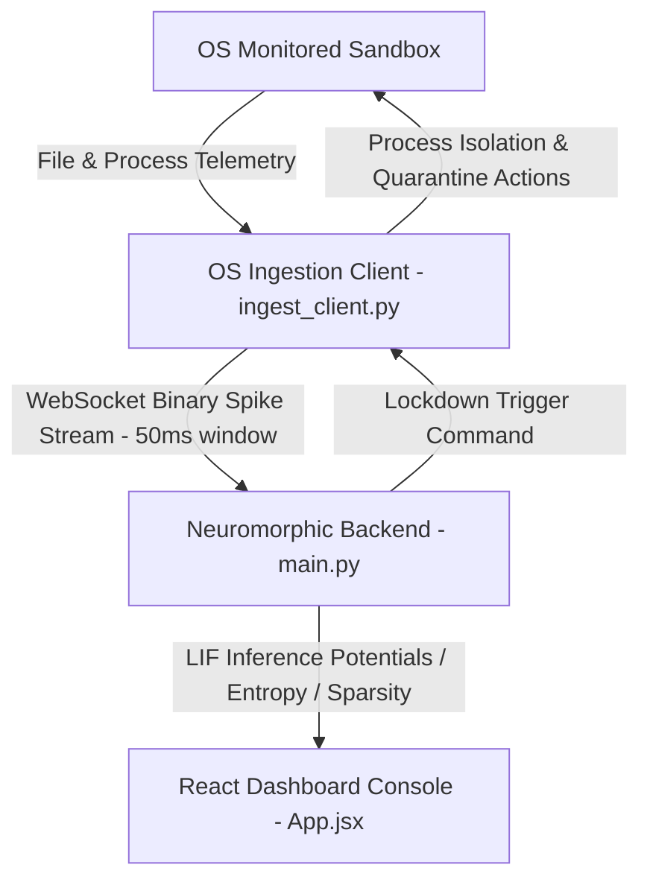

# Aegis-Spike: Cognitive Edge-Based Neuromorphic EDR

Aegis-Spike is an advanced Endpoint Detection and Response (EDR) system that utilizes an online-learning **Spiking Neural Network (SNN)** to detect, classify, and neutralize zero-day security threats at the system edge. 

Instead of relying on cloud-based deep learning or static malware signature libraries, Aegis-Spike maps system telemetry (file system activity and process thread counts) into a stream of high-precision binary spike events. A Leaky Integrate-and-Fire (LIF) network evaluates these spike sequences in real-time, detecting anomalies through temporal sequence collapses and statistical breaches.

---

## 🏗️ System Architecture & Telemetry Pipeline

Aegis-Spike operates as a three-component distributed system:



1. **OS Ingestion Client**: Monitored directories are continuously watched using filesystem events. Active thread counts are queried and filtered. Anomalous state changes are encoded as binary spike vectors.
2. **Neuromorphic Backend**: Runs an online-learning LIF network. Calibrates against system baselines, processes spikes, calculates statistical bounds, and triggers lockdowns when threat conditions are met.
3. **React Dashboard Console**: Renders live inference sparsity, Shannon entropy, and membrane potential Z-Scores. Features a real-time SNN topology canvas, synaptic weight heatmap updates, and synthesizes audio feedback using the Web Audio API.

---

## 📂 Codebase Directory Map

Click any file path below to inspect the implementation details:

*   **`backend/`** — Neuromorphic engine, server endpoints, and validation suites.
    *   [snn_model.py](file:///m:/Spike/backend/snn_model.py): Houses the `NeuromorphicEngine` class. Implements a 2-layer Leaky Integrate-and-Fire SNN using `snntorch`. Performs online surrogate-gradient backpropagation SGD updates.
    *   [main.py](file:///m:/Spike/backend/main.py): FastAPI backend running uvicorn. Handles WebSocket streams for telemetry client and web dashboard, and broadcasts active containment policies.
    *   [benchmark_suite.py](file:///m:/Spike/backend/benchmark_suite.py): A CLI validation suite that simulates all zero-day threat profiles, evaluates network classification performance, and exports reports and metrics charts.
    *   [requirements.txt](file:///m:/Spike/backend/requirements.txt): Backend dependencies (e.g., `torch`, `snntorch`, `fastapi`, `websockets`, `matplotlib`).
*   **`client/`** — System telemetry sensor agent.
    *   [ingest_client.py](file:///m:/Spike/client/ingest_client.py): System agent monitoring filesystem activity using `watchdog` and thread activity using `psutil`. Streams spike data over WebSockets and performs local process termination and file quarantine.
    *   [requirements.txt](file:///m:/Spike/client/requirements.txt): Client dependencies (e.g., `watchdog`, `psutil`, `websockets`).
*   **`frontend/`** — Cyberpunk Interactive UI Console.
    *   [App.jsx](file:///m:/Spike/frontend/src/App.jsx): Core React dashboard. Handles WebSockets, renders live math equations, interactive Canvas topology nodes, synapic weights matrix heatmap, threat alerts, and Web Audio synths.
    *   [App.css](file:///m:/Spike/frontend/src/App.css): Dark retro-cyberpunk styling definitions (neon colors, glassmorphism layouts, glowing alert pulses).
*   **`output/`** — Evaluated validation reports and telemetry plots.
    *   [AEGIS_SPIKE_BENCHMARK_REPORT.md](file:///m:/Spike/output/AEGIS_SPIKE_BENCHMARK_REPORT.md): Performance summary of all simulated threat profiles detailing detection times and response latency.
    *   `.png` files (e.g., `ransomware_benchmark.png`): High-resolution charts plotting membrane potential spikes, Shannon entropy shifts, and average prediction errors over time for each threat scenario.

---

## 🧮 Theoretical Foundation & Math Formulations

The SNN classifies anomalies by integrating events across time. The mathematical indicators visualized on the dashboard include:

### 1. Leaky Integrate-and-Fire (LIF) Neuron Model
The membrane potential $V(t)$ of each LIF neuron is updated at step $t$ according to:
$$V(t) = \beta V(t-1) + W X(t) - S(t-1) V_{reset}$$
Where:
- $\beta$ is the membrane decay rate constant (leak factor).
- $W$ represents synaptic weights.
- $X(t)$ is the incoming spike vector.
- $S(t-1)$ represents the output spike at the previous step, which resets the potential if it exceeds the threshold $V_{thr}$.

### 2. Inference Sparsity
Measures the density of neural firings across a network of $N$ neurons over time window $T$:
$$S = \left( 1 - \frac{\sum_{t=1}^{T} \sum_{i=1}^{N} s_i(t)}{N \times T} \right) \times 100\%$$
*A collapse in sparsity indicating hyperactive neural activity is characteristic of ransomware or thread duplication attacks.*

### 3. Shannon Entropy
Calculates the uncertainty and dispersion of events over the monitored time window:
$$H(X) = - \sum_{i} P(s_i) \log_2 P(s_i)$$
*Highly compressed or periodic telemetry actions (such as high-speed encryptors) collapse the system's entropy toward zero.*

### 4. Rolling Membrane Potential Z-Score
Evaluates how far the hidden layer's membrane potentials deviate from the calibrated benign baseline:
$$Z = \frac{1}{M} \sum_{i=1}^{M} \left| \frac{v_i - \mu_i}{\sigma_i} \right|$$
Where $\mu_i$ and $\sigma_i$ are the calibrated mean and standard deviation of membrane potential $v_i$ for neuron $i$, and $M$ is the number of monitored potentials.

---

## 🚀 Installation & Setup

Ensure you have **Python 3.10+** and **Node.js 18+** installed.

### 1. Clone & Setup Virtual Environment
Run the following commands in your terminal:
```bash
# Clone the repository
git clone https://github.com/saprax9s/Aegis-Spike.git
cd Aegis-Spike

# Create and activate python virtual environment
python -m venv .venv
# On Windows PowerShell:
.venv\Scripts\activate
# On Linux/macOS:
source .venv/bin/activate

# Install requirements
pip install -r backend/requirements.txt
pip install -r client/requirements.txt
```

### 2. Install Frontend Dependencies
```bash
cd frontend
npm install
cd ..
```

---

## 🕹️ How to Run the Application

### Option A: Run the Headless Benchmark Suite
To validate the neuromorphic model, execute:
```bash
python backend/benchmark_suite.py
```
This runs a 120-step calibration using simulated normal actions, processes 9 distinct threat scenarios, generates classification charts in `output/`, and exports a summary report to `output/AEGIS_SPIKE_BENCHMARK_REPORT.md`.

### Option B: Run the Full Interactive System
To run the interactive cyberpunk console, start these three processes in separate terminal instances:

1.  **FastAPI Backend Server**:
    ```bash
    cd backend
    python main.py
    ```
    *API endpoints run at http://127.0.0.1:8000*

2.  **React Frontend Dashboard**:
    ```bash
    cd frontend
    npm run dev
    ```
    *Interactive UI runs at http://localhost:5173*

3.  **OS Ingestion Client**:
    *(Note: To allow the client to terminate unauthorized processes or move system files to quarantine, run this terminal as **Administrator**)*
    ```bash
    cd client
    python ingest_client.py
    ```
    *Telemetry agent watches: `m:\Spike\monitored_directory`*

---

## 🛑 Dual-Gate Lockdown Trigger Conditions

Aegis-Spike uses a double-gated mechanism to minimize false-positives while ensuring rapid containment:

```
                  +-----------------------------------------+
                  |  Telemetry Input: Spike Vector Received |
                  +-----------------------------------------+
                                       |
                                       v
                     +-----------------------------------+
                     |  SNN Computes Next-State Error    |
                     +-----------------------------------+
                                       |
                                       v
                +---------------------------------------------+
                | Gate 1: Neural Temporal Sequence Collapse?  |
                | (avg_pred_error > baseline * 3.0 or > 0.45) |
                +---------------------------------------------+
                        /                             \
                     YES                               NO
                      /                                 \
                     v                                   v
      +------------------------------+             +--------------+
      |  Evaluate Gate 2 Anomalies   |             |   No Threat  |
      +------------------------------+             |   Detected   |
         /                        \                +--------------+
     Z-Score > 4.0?         Entropy Shift > 0.4?
       /                            \
     YES                            YES
     /                                \
    v                                  v
+----------------------------------------+
|  ENGAGE ACTIVE SHIELD LOCKDOWN TRIGGER |
+----------------------------------------+
```

When a lockdown is triggered:
- The backend sends a containment command to the Ingestion Client.
- The Ingestion Client suspends/terminates the calling process and quarantines the affected file to `quarantine/`.
- The frontend triggers audio sirens and locks the sandbox visual file system.

---

## ☣️ Telemetry Simulation Scenarios

Aegis-Spike simulates the following threat scenarios to validate classification logic:

| Profile ID | Simulation telemetry vector | Firing Behavior | EDR Defense Challenge |
| :--- | :--- | :--- | :--- |
| **Ransomware** | `[1, 1, 0, 0, 0]` | Fast, compressed file writes at `10ms` intervals. | Triggers membrane Z-Score breach under 350ms. |
| **Spyware** | `[1, 0, 0, 0, 0]` | Low-frequency periodic directory scans at `450ms` intervals. | Remains below baseline limits to avoid false-positives. |
| **Fork Bomb** | `[0, 1, 0, 0, 0]` | Accelerating process thread spawns compressing down to `10ms` intervals. | Triggers a massive output spike surge. |
| **Delayed Ransomware** | `[1, 1, 0, 0, 0]` | Slow file encryption sequences at `1.2s` intervals. | Tests LIF leak-rate memory Integration. |
| **Trojan Dropper** | `[0, 1, 0, 0, 0]` followed by `[1, 0, 0, 0, 0]` | Thread surges followed immediately by rapid payload file extractions. | Evaluates multi-stimulus sequential pattern recognition. |
| **Network Worm** | `[0, 1, 1, 0, 0]` | High thread and socket activity at `150ms` intervals. | Classified without triggering file quarantines. |
| **Masquerading** | `[1, 0, 0, 0, 1]` | File modifications coupled with script execution. | Detects script-driven modifications. |
| **Living off the Land (LOTL)** | `[0, 1, 0, 0, 1]` | Dual process and script executions mimicking administrative tools. | Baseline deviation isolates scripting pathways. |
| **Memory Injection** | `[0, 1, 0, 1, 0]` | Escalated process thread creation. | Z-Score detects memory potential spikes. |
