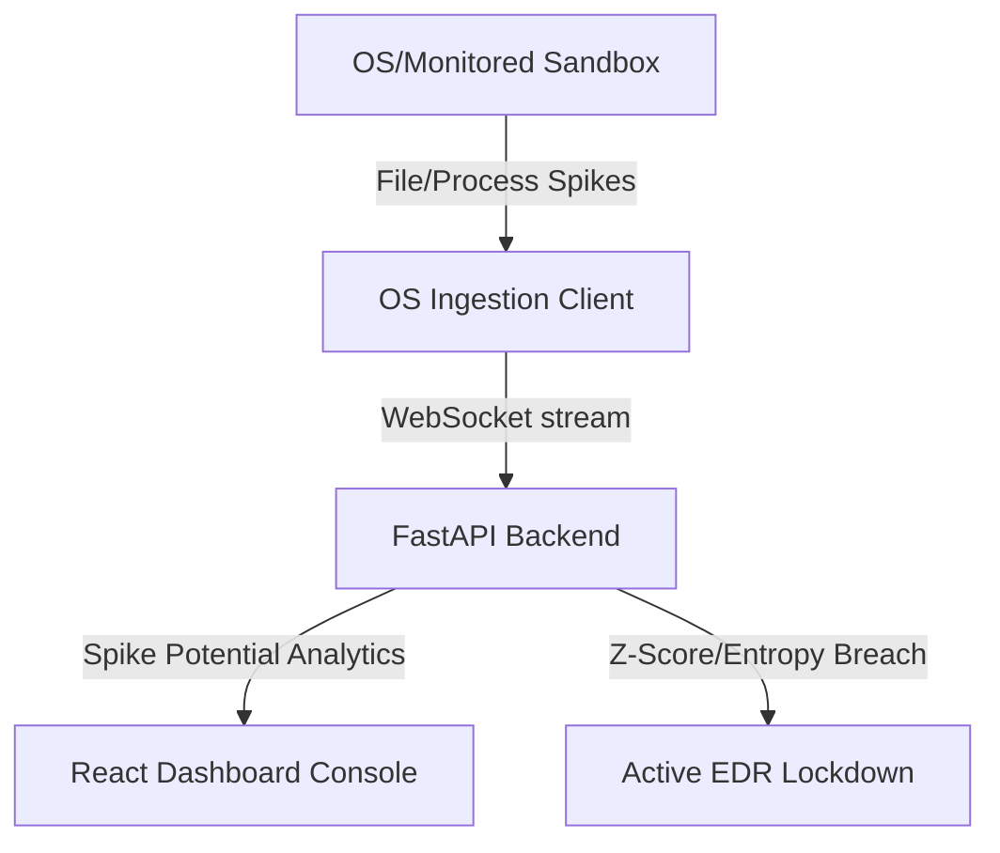

# Aegis-Spike EDR Console - Walkthrough

Welcome to the **Aegis-Spike EDR (Endpoint Detection & Response)** repository. Aegis-Spike is a cognitive, edge-based neuromorphic security solution that monitors system telemetry (filesystem modifications and thread activity) and processes it in real-time through an online-learning **Spiking Neural Network (SNN)**.

---

## 🏗️ System Architecture & Mechanics

Aegis-Spike is built as a three-part distributed system:



1. **Ingestion Client (`client/ingest_client.py`)**:
   - Monitors a dedicated local directory (`monitored_directory`) using Python's `watchdog` to capture real-time file creation, deletion, or renaming.
   - Monitors active system thread changes using `psutil` (excluding itself to avoid feedback loops).
   - Bundles activity into a binary spike vector `[file_spike, thread_spike]` within a high-precision `50ms` rolling window, streaming it via WebSockets to the backend.

2. **Neuromorphic Backend (`backend/main.py` & `backend/snn_model.py`)**:
   - Receives the telemetry spikes and runs them through a 2-layer **Leaky Integrate-and-Fire (LIF) SNN** using `snntorch`.
   - **Online Learning**: The SNN trains itself in real-time (using surrogate gradient SGD backpropagation) to predict the next system state. 
   - **Cognitive Threat Analysis**: The backend calculates:
     - **Inference Sparsity**: Firing density of the network.
     - **Shannon Entropy**: Uncertainty/dispersion of events.
     - **Z-Score Deviation**: Current LIF membrane potentials compared against a calibrated baseline of normal system activity.
   - **Active Shield Lockdown**: If the temporal sequence collapses (spiking prediction error) **AND** statistical boundaries are breached (Z-score > 4.0 or entropy collapses), the backend engages a defensive lockdown, shutting down encryption channels.

3. **React UI Console (`frontend/src/App.jsx`)**:
   - Connects to the backend via WebSockets to display:
     - Real-time firing sparsity, Shannon entropy, Z-score levels.
     - SNN topology map with synaptic arcs and active nodes.
     - Deep FC1 synaptic weights heatmap updated on the fly.
     - Local sandbox file node status (Secured vs. Encrypted).
     - Interactive incident reports and sound synthesis cues (Web Audio API hums, sirens, chimes).

---

## 🚀 How to Run the Project

Ensure you have Python 3.13 and Node.js installed on your system.

### 1. Initialize Virtual Environment & Dependencies
Open a PowerShell/command prompt in the root of the project:
```bash
# Create Python virtual environment
python -m venv .venv

# Activate virtual environment
.venv\Scripts\activate

# Install backend dependencies
pip install -r backend/requirements.txt

# Install client dependencies
pip install -r client/requirements.txt
```

### 2. Run the Headless CLI Benchmark Suite
You can validate the neuromorphic engine and generate visual telemetry reports immediately without spinning up the frontend:
```bash
python backend/benchmark_suite.py
```
- **What it does**: Calibrates the SNN for 120 steps, simulates 6 distinct threat profiles, maps their metrics, and exports reports.
- **Outputs**:
  - Telemetry charts and graphs saved to `output/` (e.g., `ransomware_benchmark.png`, `dropper_benchmark.png`, etc.).
  - A consolidated Markdown report: **[output/AEGIS_SPIKE_BENCHMARK_REPORT.md](file:///m:/Spike/output/AEGIS_SPIKE_BENCHMARK_REPORT.md)** detailing detection times, latency, and adapted weight matrices.

### 3. Run the Live EDR Application (GUI)
To experience the interactive cyberpunk console, run the three services concurrently:

1. **Start the FastAPI Backend**:
   ```bash
   cd backend
   ..\.venv\Scripts\python main.py
   ```
   *Runs at http://127.0.0.1:8000*

2. **Start the React Frontend**:
   ```bash
   cd frontend
   npm install
   npm run dev
   ```
   *Runs at http://localhost:5173*

3. **Start the OS Ingestion Client**:
   ```bash
   cd client
   ..\.venv\Scripts\python ingest_client.py
   ```

---

## 🛑 EDR Active Shield Lockdown Trigger Conditions

To guarantee maximum protection with minimal false-positives, the Aegis-Spike EDR agent utilizes a **dual-gate decision logic** before triggering an active system shield lockdown (neutralizing process execution and isolating filesystem channels):

1. **Gate 1: Neural Temporal Sequence Collapse (Prediction Error)**
   - The SNN model continuously predicts the next-step system telemetry footprint in real-time.
   - If incoming system actions deviate significantly from SNN predictions, the **Average Prediction Error** spikes. 
   - **Trigger Constraint**: The rolling average prediction error must exceed **3.0x the baseline prediction error** (i.e. `avg_pred_error > baseline * 3.0`) or exceed `0.45` in absolute value.

2. **Gate 2: Statistical Anomaly Boundary Breach (Z-Score or Entropy)**
   - **LIF Membrane Z-Score Deviation**: The EDR maps the hidden and output LIF membrane potentials to a Z-score metric based on a calibrated baseline. An alert threshold is breached if `Z-Score > 4.0`.
   - **Shannon Entropy Deviation**: The EDR monitors the event entropy. If encryption runs compress the timing sequences, the entropy shifts by more than `0.40` deviation from the calibrated baseline mean.
   - **Trigger Constraint**: At least one of the statistical boundaries (either the Z-score limit OR the Shannon entropy limit) must be breached concurrently with Gate 1.

> [!IMPORTANT]
> **Active Lockdown Condition**:
> `Lockdown Active = Gate 1 (Error Spike) AND (Gate 2a (Z-Score > 4.0) OR Gate 2b (Entropy Shift > 0.4))`
>
> When this logic resolves to `True`, the backend engages the shield, blocks further socket client traffic, and holds file changes in a safe quarantine isolation loop.

---

## ☣️ Telemetry Simulation Profiles

Aegis-Spike simulates **six** distinct zero-day telemetry profiles to test SNN defenses:

| Threat Profile | Simulation Vector | EDR Telemetry Footprint | EDR Defense Challenge |
| :--- | :--- | :--- | :--- |
| **Ransomware** | `ransomware` | Fast, compressed file writes (`[1, 1]`) at `10ms` intervals. | Triggers high-frequency Z-score breach. |
| **Spyware** | `spyware` | Stealthy, low-frequency periodic directory scans (`[1, 0]`) at `450ms` intervals. | Remains below baseline limits, validating no false positives. |
| **Fork Bomb** | `fork_bomb` | Accelerating process thread spawns (`[0, 1]`) compressing down to `10ms` intervals. | Massive thread potential buildup triggers alarm. |
| **Delayed Ransomware** | `delayed_crypto` | Slow-periodic file encryption sequences (`[1, 1]`) at `1.2s` intervals. | Evasion test. SNN's LIF temporal leak memory slowly integrates potentials until a Z-score breach triggers anyway. |
| **Trojan Dropper** | `dropper` | 5 process/thread surges (`[0, 1]`), followed immediately by 15 rapid payload file extractions (`[1, 0]`). | Tests multi-stimulus sequential detection. |
| **Network Worm** | `net_worm` | Steady socket/process thread surges (`[0, 1]`) at `150ms` intervals. | Telemetry surge is classified without triggering false file lockdowns. |
